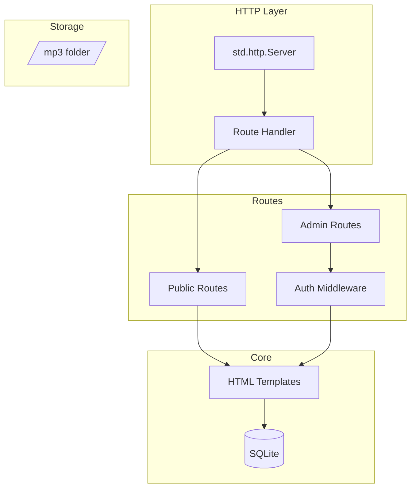

# Design Document

## Overview

A pure Zig web application using `std.http.Server` for HTTP handling and SQLite for persistence. The app manages MP3 playlists with a public frontend for playback and a protected admin backend.

**Technologies:**
- Zig 0.15.x standard library HTTP server
- SQLite via Zig bindings (zig-sqlite)
- Bootstrap 5 (CDN) for UI
- HTML5 Audio API for playback
- SortableJS for drag-and-drop

## Architecture



## Components and Interfaces

### Project Structure

```
src/
├── main.zig              # Entry point, HTTP server setup
├── router.zig            # Route matching and dispatch
├── auth.zig              # Session management, login/logout
├── db.zig                # SQLite connection and queries
├── handlers/
│   ├── public.zig        # Homepage, playlist player
│   └── admin.zig         # Dashboard, playlist CRUD
├── templates/
│   ├── layout.zig        # Base HTML layout generator
│   ├── public.zig        # Public page templates
│   └── admin.zig         # Admin page templates
└── utils/
    ├── mp3.zig           # MP3 validation
    ├── multipart.zig     # Form/file upload parsing
    └── session.zig       # Cookie-based sessions
public/
├── mp3/                  # Uploaded MP3 files
└── styles.css            # Custom styles
```

### Router Design

```zig
const routes = .{
    .{ "GET",  "/",                    handlers.public.index },
    .{ "GET",  "/playlist/:slug",      handlers.public.playlist },
    .{ "GET",  "/mp3/:filename",       handlers.public.serveMP3 },
    .{ "GET",  "/admin/login",         handlers.admin.loginPage },
    .{ "POST", "/admin/login",         handlers.admin.login },
    .{ "GET",  "/admin/logout",        handlers.admin.logout },
    .{ "GET",  "/admin",               handlers.admin.dashboard },
    .{ "GET",  "/admin/playlists",     handlers.admin.listPlaylists },
    .{ "GET",  "/admin/playlists/new", handlers.admin.newPlaylist },
    .{ "POST", "/admin/playlists",     handlers.admin.createPlaylist },
    .{ "GET",  "/admin/playlists/:id", handlers.admin.editPlaylist },
    .{ "POST", "/admin/playlists/:id", handlers.admin.updatePlaylist },
    .{ "POST", "/admin/playlists/:id/delete", handlers.admin.deletePlaylist },
    .{ "POST", "/admin/playlists/:id/reorder", handlers.admin.reorderSongs },
};
```

### Session Management

- Cookie-based sessions with random token
- Session data stored in memory HashMap
- Session expiry after 24 hours of inactivity

```zig
const Session = struct {
    authenticated: bool,
    created_at: i64,
    last_access: i64,
};

var sessions: std.StringHashMap(Session) = undefined;
```

## Data Models

### Database Schema

```sql
CREATE TABLE playlists (
    id INTEGER PRIMARY KEY AUTOINCREMENT,
    name TEXT NOT NULL,
    slug TEXT NOT NULL UNIQUE,
    created_at INTEGER DEFAULT (strftime('%s', 'now')),
    updated_at INTEGER DEFAULT (strftime('%s', 'now'))
);

CREATE TABLE songs (
    id INTEGER PRIMARY KEY AUTOINCREMENT,
    title TEXT NOT NULL,
    filename TEXT NOT NULL UNIQUE,
    file_path TEXT NOT NULL,
    created_at INTEGER DEFAULT (strftime('%s', 'now'))
);

CREATE TABLE playlist_songs (
    id INTEGER PRIMARY KEY AUTOINCREMENT,
    playlist_id INTEGER NOT NULL,
    song_id INTEGER NOT NULL,
    position INTEGER NOT NULL DEFAULT 0,
    FOREIGN KEY (playlist_id) REFERENCES playlists(id) ON DELETE CASCADE,
    FOREIGN KEY (song_id) REFERENCES songs(id) ON DELETE CASCADE,
    UNIQUE(playlist_id, song_id)
);
```

### Zig Structs

```zig
const Playlist = struct {
    id: i64,
    name: []const u8,
    slug: []const u8,
    created_at: i64,
    updated_at: i64,
};

const Song = struct {
    id: i64,
    title: []const u8,
    filename: []const u8,
    file_path: []const u8,
    created_at: i64,
};
```

## Error Handling

| Error | Handler | Response |
|-------|---------|----------|
| Invalid MP3 | Validate magic bytes | 400 + error message |
| Auth failure | Check session | 302 redirect to /admin/login |
| Not found | Route miss | 404 page |
| DB error | Query failure | 500 page |
| File too large | Size check | 400 + error message |

### MP3 Validation

```zig
fn isValidMp3(data: []const u8) bool {
    if (data.len < 3) return false;
    // ID3v2 header
    if (std.mem.eql(u8, data[0..3], "ID3")) return true;
    // MP3 frame sync
    if (data[0] == 0xFF and (data[1] & 0xE0) == 0xE0) return true;
    return false;
}
```

## Testing Strategy

### Automated Tests

1. **Unit Tests** (`zig build test`)
   - MP3 validation with valid/invalid samples
   - Slug generation from playlist names
   - Route matching logic
   - Session token generation

### Manual Verification

1. **Auth Flow** - Login/logout, session persistence
2. **Playlist CRUD** - Create, edit, delete playlists
3. **MP3 Upload** - Valid/invalid files, multiple uploads
4. **Drag-and-Drop** - Reorder songs, verify persistence
5. **Public Player** - Play songs, auto-advance, song selection
