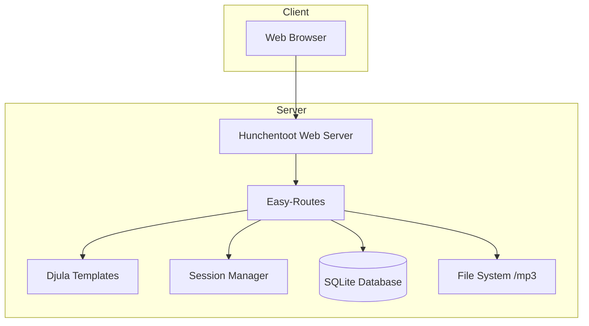
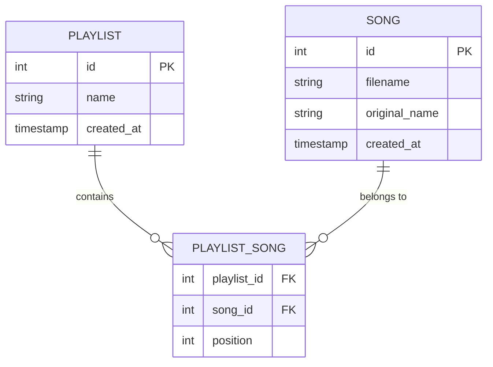

# Design Document: Lisp Music Manager

## Overview

A Common Lisp web application for managing MP3 playlists using Hunchentoot as the web server, SQLite for persistence, and Bootstrap 5 for the UI. The system has a public frontend for music playback and a protected admin backend.

## Architecture



## Technology Stack

| Component | Technology |
|-----------|------------|
| Language | Common Lisp (SBCL) |
| Web Server | Hunchentoot |
| Routing | easy-routes |
| Templating | Djula |
| Database | cl-dbi + SQLite3 |
| Config | cl-dotenv |
| Package Manager | Quicklisp |

## Project Structure

```
music-manager/
├── music-manager.asd          # ASDF system definition
├── .env                       # Credentials (not in git)
├── .env.example               # Template for .env
├── src/
│   ├── package.lisp           # Package definition
│   ├── config.lisp            # Load .env and settings
│   ├── db.lisp                # Database connection and schema
│   ├── models.lisp            # Data access functions
│   ├── auth.lisp              # Authentication logic
│   ├── routes.lisp            # All route definitions
│   ├── upload.lisp            # File upload and validation
│   └── main.lisp              # Application entry point
├── templates/
│   ├── base.html              # Base layout with theme toggle
│   ├── admin/
│   │   ├── login.html
│   │   ├── dashboard.html
│   │   └── playlist-form.html
│   └── public/
│       ├── playlist.html
│       └── 404.html
├── static/
│   ├── css/
│   │   └── custom.css
│   └── js/
│       ├── theme.js           # Theme switching
│       ├── sortable.js        # Drag-drop library
│       └── playlist.js        # Playlist management
└── mp3/                       # Uploaded MP3 files
```

---

## Components and Interfaces

### 1. Configuration Module (`config.lisp`)

Loads environment variables from `.env` file.

```lisp
;; Interface
(defun load-config () ...)
(defun get-config (key) ...)  ; Returns value for ADMIN_USER, ADMIN_PASS, etc.
```

### 2. Database Module (`db.lisp`)

Manages SQLite connection and schema initialization.

```lisp
;; Interface
(defun init-db () ...)        ; Creates tables if not exist
(defun get-connection () ...) ; Returns db connection
```

### 3. Models Module (`models.lisp`)

Data access layer for playlists and songs.

```lisp
;; Playlist operations
(defun get-all-playlists () ...)
(defun get-playlist (id) ...)
(defun create-playlist (name) ...)
(defun update-playlist (id name) ...)
(defun delete-playlist (id) ...)

;; Song operations
(defun get-songs-for-playlist (playlist-id) ...)
(defun add-song-to-playlist (playlist-id song-id position) ...)
(defun remove-song-from-playlist (playlist-id song-id) ...)
(defun update-song-order (playlist-id song-ids) ...)
(defun create-song (filename original-name) ...)
```

### 4. Authentication Module (`auth.lisp`)

Session-based authentication using Hunchentoot sessions.

```lisp
;; Interface
(defun authenticate (username password) ...)  ; Returns t/nil
(defun login-user () ...)                      ; Sets session
(defun logout-user () ...)                     ; Clears session
(defun require-auth () ...)                    ; Middleware check
```

### 5. Upload Module (`upload.lisp`)

Handles MP3 file validation and storage.

```lisp
;; Interface
(defun validate-mp3 (file-path) ...)    ; Checks magic bytes
(defun save-uploaded-file (post-file) ...) ; Returns saved filename or nil
```

Validation checks:
1. File extension is `.mp3`
2. First bytes are `ID3` (ID3v2 tag) or `0xFF 0xFB` (MP3 frame sync)

### 6. Routes Module (`routes.lisp`)

All HTTP endpoints using easy-routes.

| Method | Path | Auth | Description |
|--------|------|------|-------------|
| GET | `/` | No | Redirect to first playlist or welcome |
| GET | `/playlist/:id` | No | Public playlist player |
| GET | `/admin/login` | No | Login form |
| POST | `/admin/login` | No | Process login |
| GET | `/admin/logout` | Yes | Logout |
| GET | `/admin` | Yes | Dashboard |
| GET | `/admin/playlist/new` | Yes | New playlist form |
| POST | `/admin/playlist` | Yes | Create playlist |
| GET | `/admin/playlist/:id/edit` | Yes | Edit playlist form |
| POST | `/admin/playlist/:id` | Yes | Update playlist |
| POST | `/admin/playlist/:id/delete` | Yes | Delete playlist |
| POST | `/admin/upload` | Yes | Upload MP3 files |
| POST | `/admin/playlist/:id/order` | Yes | Update song order |

---

## Data Models

### SQLite Schema

```sql
-- Playlists table
CREATE TABLE IF NOT EXISTS playlists (
    id INTEGER PRIMARY KEY AUTOINCREMENT,
    name TEXT NOT NULL,
    created_at TIMESTAMP DEFAULT CURRENT_TIMESTAMP
);

-- Songs table
CREATE TABLE IF NOT EXISTS songs (
    id INTEGER PRIMARY KEY AUTOINCREMENT,
    filename TEXT NOT NULL UNIQUE,
    original_name TEXT NOT NULL,
    created_at TIMESTAMP DEFAULT CURRENT_TIMESTAMP
);

-- Junction table for many-to-many relationship
CREATE TABLE IF NOT EXISTS playlist_songs (
    playlist_id INTEGER NOT NULL,
    song_id INTEGER NOT NULL,
    position INTEGER NOT NULL,
    PRIMARY KEY (playlist_id, song_id),
    FOREIGN KEY (playlist_id) REFERENCES playlists(id) ON DELETE CASCADE,
    FOREIGN KEY (song_id) REFERENCES songs(id) ON DELETE CASCADE
);
```

### Entity Relationship



---

## Error Handling

| Error Type | Handling Strategy |
|------------|------------------|
| Missing .env | Exit with clear error message |
| Invalid credentials | Flash message, stay on login page |
| Invalid MP3 upload | Return JSON error, reject file |
| Playlist not found | Render 404 page |
| Database errors | Log error, show generic message |
| File system errors | Log error, return upload failure |

---

## Testing Strategy

### Automated Tests

Due to the nature of this project (new Lisp codebase), testing will focus on:

1. **Unit tests** for validation logic (`validate-mp3` function)
2. **Integration tests** for database operations
3. **Route tests** using HTTP client

Test file: `tests/main-test.lisp`

```bash
# Run tests
sbcl --load music-manager.asd --eval "(asdf:test-system :music-manager)"
```

### Manual Verification

Since this is a new project, manual verification via browser:

1. Start server and access admin login
2. Login with .env credentials
3. Create playlist with MP3 uploads
4. Verify drag-drop reordering
5. Test theme toggle persistence
6. Access public playlist URL
7. Verify audio playback and auto-next

---

## Frontend Components

### Admin UI

- Bootstrap 5 dashboard layout
- Theme toggle in navbar (uses `data-bs-theme` attribute)
- SortableJS for drag-drop
- AJAX file upload with progress

### Public Player

- Clean Bootstrap card layout
- HTML5 `<audio>` element with custom controls
- JavaScript for playlist navigation
- Highlight current song in list
